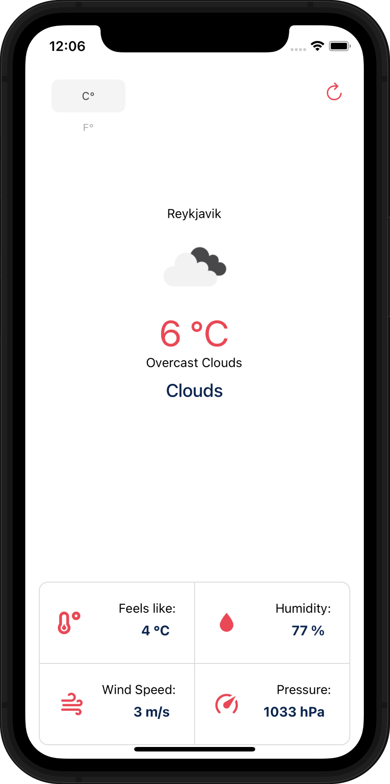

&nbsp;

<p align="center">
  
</p>

&nbsp;

# M6 - React Native App

For this react native project I used a tutorial to create a simple weather application, using OpenWeather API, that displays the current weather at your location. I also used [Expo](https://expo.dev/) for this.

&nbsp;

## To view the app locally (You will need a Mac and Xcode to do this)

#### Clone the app to a folder on your computer:

```
git clone https://github.com/Kristrunu/m6-native.git
```

#### Go to the app folder:

```
cd m6-native
```

- ATH: I had some trouble with the folder situation, for some reason the project is in two folders named the same. It's not like that in my computer or in vscode but it's like that in github, so be sure to be in the right m6-native folder. You can us ls command in terminal to see if you are in the right folder.

#### install dependencies:

```
npm install
```

or

```
yarn
```

#### Run the app:

```
npm run start
```

or

```
yarn start
```

## You need to add .env file and contact me to get the API key to put in that file.

#### Open localhost:19002 in your browser

#### Select "Run on IOS sumulator"

- You may need to open Xcode Simulator on your computer
